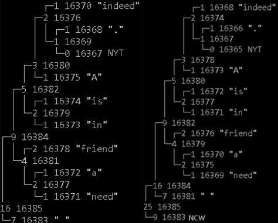

# Modified Adaptive Huffman Coding

This repository contains an implementation of the **Modified Adaptive Huffman Coding** algorithm for large alphabets (whole words) as described in Mikhail Tokovarov’s 2017 paper. 

[📄 View the Research Paper ](docs/paper.pdf)

---


- **code.cpp**  
  The standalone C++ source implementing:
  - Word‑level adaptive Huffman tree with separate NYT and NCW nodes  
  - Encoding: reuse of known words, NCW+ASCII+`<DEL>` for new words  
  - Decoding: bit‑by‑bit tree traversal, NCW detection, ASCII recovery  
  - Forgetting: removal of low‑relevance words to bound memory  

  
---

## 📝 Introduction

Adaptive Huffman Coding dynamically updates its code tree as it processes input. The classic FGK algorithm uses a single NYT (“Not Yet Transmitted”) node for both indicating where to attach new symbols and signaling their arrival. Tokovarov’s **modified** approach introduces a separate **NCW** (“New‑Coming Word”) node:

1. **NYT node** — marks where in the tree new symbols (words) are inserted.  
2. **NCW node** — signals that the next bits are the raw ASCII representation of a brand‑new word.  

By treating **whole words** as symbols, this method achieves better compression on natural language text, and the separate NCW node reduces overhead when new words arrive frequently.

**🖼️ Visual Comparison: Traditional vs Modified Huffman Tree<br>
Note how NCW separates out new word logic from insertion point.**

  

---

## 📖 Background & Algorithm Overview

1. **Tree Structure**  
   - Each node has a **weight**, **key number**, and optionally stores a word.  
   - The **NYT** leaf always has weight 0 and the smallest key.  
   - The **NCW** leaf also starts with weight 0 and is used solely to mark new‑word signals.
  
**🖼️ Tree Example: Word-Based Huffman Tree<br>
Shows how the word-level tree evolves as new tokens are added**

  

2. **Encoding**  
   - If a word already exists in the tree, output its current code (path from root) and update the tree.  
   - Otherwise:
     1. Output the **NCW** node’s code.  
     2. Update the NCW node’s weight.  
     3. Output the word’s ASCII bytes (8‑bit each) followed by a delimiter `<DEL>`.  
     4. Insert the new word under the old NYT node and update its weight.  

3. **Decoding**  
   - Read bits until you match a leaf’s code:
     - If it’s a **normal** leaf, recover the word and update the tree.  
     - If it’s **NCW**, update NCW, then read 8‑bit ASCII chunks until `<DEL>`, reconstruct the new word, insert it, and update.  

---

## 🔧 Prerequisites

- A modern C++ compiler (GCC, Clang, or MSVC) supporting C++11 or later.  
- Standard C++ library—no external dependencies.

---

## 🚀 Building & Running

1. **Compile**

      ```bash
   g++ -std=c++17 -O2 code.cpp -o huffman

2. **Run**

      ```bash
      ./huffman

      Enter text to encode and decode:
      I am Human living in a Human World.

      Tokens to be encoded:
      'I' 'am' 'Human' 'living' 'in' 'a' 'Human' 'World.'

      Encoded Bitstream:
      1I|1am|1Human|1living|1in|1a|0010World.|

      Decoded Text:
      I am Human living in a Human World.

      Verification:
      Success

---

## 📊 Performance & Compression

The following figures demonstrate the bit-efficiency of this model vs classical Huffman variants.


**🖼️ SOBR Comparison (Sent-to-Original Bits Ratio)**


**🖼️ SSOBR Delta Across Variants**


